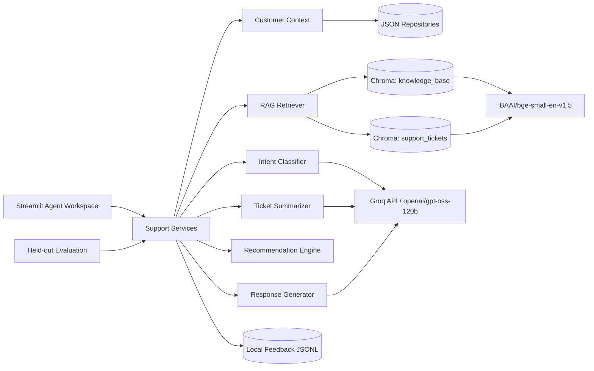

# NovaMart Multi-Category Retail Customer Support Copilot

[live Demo](http://localhost:8502)

## Project overview

NovaMart is a fictional multi-category retailer. The copilot helps a human support agent understand a ticket, retrieve verified customer/order context, classify intent, find authoritative policy, retrieve similar historical cases, recommend the next action, and draft a grounded response.

The system is **advisory only**. It does not execute refunds, cancellations, account changes, payment actions, or other destructive operations.

## Architecture



## Tech stack

- Python
- Groq API
- `openai/gpt-oss-120b`
- Hugging Face `BAAI/bge-small-en-v1.5`
- ChromaDB PersistentClient
- Pydantic / pydantic-settings
- Streamlit
- pytest

## Dataset

- 500 fictional customers
- 1,500 orders
- 300 products
- 1,000 support tickets
- 28 knowledge documents
- 20 held-out evaluation tickets
- Eight product categories: Electronics, Fashion, Home & Kitchen, Beauty, Sports, Grocery, Books, Accessories

Customer identifiers and contact data are synthetic. Email addresses use the reserved `.invalid` domain.

### Evaluation split

The final 20 tickets are held out in `data/evaluation_tickets.json`. They are **not indexed** in the `support_tickets` Chroma collection. Their `ground_truth_*` fields are retained only for evaluation and are removed before LLM inference.

## RAG pipeline

```text
Markdown policy
   -> frontmatter metadata
   -> chunking with overlap
   -> BGE embeddings
   -> Chroma knowledge_base
   -> similarity search TOP_K

Historical tickets
   -> ground-truth fields excluded
   -> historical summary/resolution only
   -> BGE embeddings
   -> Chroma support_tickets
   -> similarity search TOP_K

Ticket
   -> minimal verified customer/order context
   -> intent + summary
   -> authoritative KB retrieval
   -> similar-ticket retrieval
   -> grounded response + citations
   -> recommendation
```

Knowledge-base documents are authoritative. Similar tickets are historical examples and are never treated as policy.

## Controlled intent taxonomy

`order_tracking`, `delivery_delay`, `missing_delivery`, `wrong_item`, `damaged_item`, `return_request`, `refund_request`, `exchange_request`, `order_cancellation`, `payment_failure`, `duplicate_charge`, `coupon_issue`, `warranty`, `product_question`, `account_issue`, `shipping_question`, `other`.

## Features

### Support queue

Filter tickets by status, priority, intent, customer tier, and product category.

### Ticket workspace

Shows customer profile, relevant order, conversation, AI summary, intent/confidence, context, recommended action, similar tickets, retrieved knowledge, suggested response, citations, and feedback.

### Knowledge base

Browse or search indexed policy documents and inspect source metadata.

### Diagnostics

Inspect model configuration, collection sizes, retrieved documents, distances, and feedback volume.

### Evaluation

The evaluation page/script reports:

- intent accuracy
- intent macro F1
- retrieval Recall@5
- retrieval Precision@5
- MRR
- groundedness rate
- citation correctness
- recommendation agreement

Generation-quality metrics such as groundedness/citation correctness are implemented as transparent evidence checks rather than pretending they are a human-quality judgment.

## Safety and grounding

The model is explicitly forbidden from inventing:

- refunds
- delivery dates
- discounts
- order status
- tracking events
- policy exceptions
- sensitive customer information

If authoritative evidence is unavailable, the response is downgraded to:

> Insufficient information — manual review recommended.


## Evaluation

From Streamlit, open **Evaluation** and run the held-out evaluation. It makes Groq calls and therefore consumes API usage.

For a script-level run:

```python
from src.evaluation.evaluator import Evaluator
print(Evaluator().run())
```

Do not substitute training/development tickets for the held-out set when reporting portfolio metrics.

## Limitations

- Synthetic data is useful for engineering demonstration but does not represent production customer behavior.
- Retrieval uses dense similarity; production could add lexical/hybrid retrieval and a learned reranker.
- The evaluation set contains 20 cases and should be expanded substantially before making quality claims.
- Generation-quality metrics are automated proxies and should be supplemented with blinded human review.
- Chroma is local/persistent for portfolio simplicity rather than a multi-user production vector service.

## Future improvements

- Add human-reviewed evaluation annotations.
- Add OpenTelemetry/LLM tracing.
- Add authentication and role-based access control.
- Add production data retention and redaction policies.
- Add CI with dependency/security scanning.
