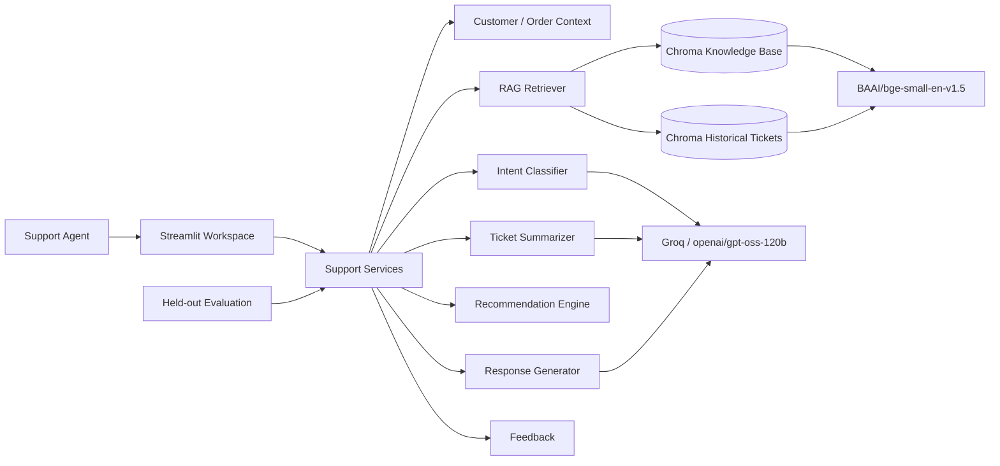

# NovaMart Multi-Category Retail Customer Support Copilot

> An AI-assisted support workspace that combines verified customer context, RAG, intent classification, similar-ticket retrieval, grounded response generation, and evaluation.

## Problem

Support agents often need to combine information from customer records, orders, historical tickets, and policy documents before answering a single request.

NovaMart turns that workflow into one agent-facing workspace while keeping the **human support agent in control**.

## What the copilot does

1. Summarizes the incoming ticket
2. Retrieves verified customer and order context
3. Classifies the support intent
4. Retrieves authoritative policy evidence
5. Finds similar historical tickets
6. Recommends the next action
7. Drafts a grounded response with citations
8. Captures feedback and evaluation signals

The system is advisory and does not execute refunds, cancellations, account changes, payment actions, or other destructive operations.

## Architecture



## RAG design

```text
Authoritative policies
    ↓
metadata + chunking
    ↓
BGE embeddings
    ↓
Chroma knowledge_base
    ↓
Top-K retrieval

Historical support tickets
    ↓
ground-truth fields excluded
    ↓
BGE embeddings
    ↓
Chroma support_tickets
    ↓
Similar-ticket retrieval

Incoming ticket
    ↓
verified context + intent + summary
    ↓
policy retrieval + similar cases
    ↓
grounded response + citations
```

**Important grounding rule:** authoritative knowledge-base documents are treated as policy. Historical tickets are examples, not policy.

## Evaluation

The project includes a held-out evaluation split and reports:

- Intent Accuracy
- Intent Macro-F1
- Retrieval Recall@5
- Retrieval Precision@5
- MRR
- Groundedness Rate
- Citation Correctness
- Recommendation Agreement

Generation-related metrics are implemented as transparent evidence checks rather than being presented as human-quality judgments.

## Dataset

Synthetic portfolio dataset:

- 500 customers
- 1,500 orders
- 300 products
- 1,000 support tickets
- 28 knowledge documents
- 20 held-out evaluation tickets
- 8 retail categories

## Safety and grounding

The system is designed not to invent:

- refunds or discounts
- delivery dates
- order status
- tracking events
- policy exceptions
- sensitive customer information

When authoritative evidence is unavailable, the system returns a manual-review recommendation instead of guessing.

## Tech stack

`Python` · `Groq API` · `openai/gpt-oss-120b` · `BAAI/bge-small-en-v1.5` · `ChromaDB` · `Pydantic` · `Streamlit` · `pytest`

## Repository structure

```text
pages/
scripts/
src/
tests/
app.py
requirements.txt
```

## Run locally

```bash
git clone https://github.com/Riya-712/Customer-Support-Copilot.git
cd Customer-Support-Copilot

python -m venv .venv
# Windows
.venv\Scripts\activate

pip install -r requirements.txt

streamlit run app.py
```

Configure the required API/model environment variables before starting the app.

## Limitations

The dataset is synthetic and the evaluation set is intentionally small for a portfolio project. Retrieval is dense-only, and Chroma runs locally rather than as a multi-user production service.


